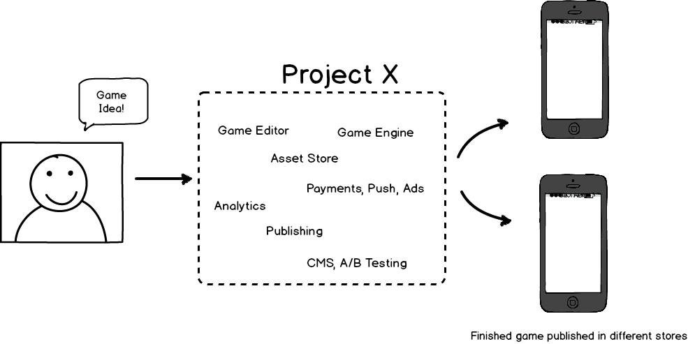

# Cocos Product Requirements Document
v0.2

## Revisions

v0.2 - 2014-07-02: Product is called _Cocos Studio_ instead of _Cocos_, Link to Launcher PRD, Redefined "Well integrated"
v0.1 - 2014-06-26: Initial version

# INTRODUCTION

## Vision

Cocos2d-x's original vision:

    Cocos2d-x is a complete toolchain for developing multi-platform games
    which goes all the way from rapid prototyping to a finished high performing game

Although Cocos2d-x vision is still valid for Cocos, it is worth adding the "easy-to-use" in it, since the User Experience is a very important part of Cocos. The updated vision is:

    Cocos is a complete, easy to use, toolchain for developing multi-platform games
    which goes all the way from rapid prototyping to a finished high performing game

Also, it is worth understanding the meaning of the vision

__"complete toolchain"__ includes:

* Scene editor: Place and edit 'nodes' like Sprites, Lights, Tile Maps, Particles, etc.
* Animation Editor: Flip-book animation editor, Skeleton animation editor, Vertex animation editor, etc.
* Physics Editor: edit physics properties like gravity, joints, shapes, body properties, etc.
* Material editor for 3d models
* Code editor, compiler, debugger and profiler
* Game engine

__"easy to use"__ means:

 * All the editors and tools are integrated in an smooth, easy-to-use way
 * The editors look-and-feel is familiar
 * The engine APIs are easy to understand and use
 * The product is easy to install, setup and update
 * It is easy to integrate Cocos with 3rd party libraries
 * If the user doesn't know how to do something, the user should find the answer in the Documentation / Help

__"multi-platform"__ means:

* Mobile: iOS, Android, Windows Phone, etc.
* Desktop: Mac, Windows, Linux, etc.
* Console: From "casual" consoles like OUYA, or Apple TV, to "hard-core" consoles like Xbox One, PS4 and Wii U
* Web: Desktop and mobile browsers

__"games"__ means:

* 2D and 3D games
* Solo and multiplayer games
* Turn-based and RTS games
* etc.

__"all the way from... to..."__ means all the game development cycle steps: 

* Prototyping: Our toolchain should provide a way to do rapid prototyping. Drag & Drop assets, using a efficient language (scripting and/or Swift language)
* Development:
* Testing:
* Publishing:

And __"finished games"__ means:

* Easy to monetize: Cocos should provide a way to monetize games by providing integration with Payment, Ads, Cross Promotion and similar services
* Analytics integration to understand that the game players are doing
* Integration with social networks

By no means, the described features are exclusive. The above mentioned features were added just to give more context to the vision.

## Product Overview

To describe Cocos using different words, Cocos is everything that is between the "I have this idea for a new game" and the published game in different Stores.

But Cocos is NOT just a collection of editors and services. Cocos might include different editors and services, but it is __key__ that these editors and services are __well integrated__: smooth workflow; and familiar, easy-to-use User Experience.

__Easy-to-Use__ is one of the most important attributes of this product. The market in the US is already very competitive with very polished, easy-to-use Game Editors. Examples:

#### [Xcode](http://developer.apple.com): a very well integrated product

Not only it is a very complete IDE, it also has a game level editor, particle editor, UI editor, profiler, OpenGL frame grabber, you can deploy to your device, etc. You can create a whole game by only using Xcode. Each new feature that is added into Xcode, it is added in a way that "makes sense". It is __easy to discover__ the new features and try them.

#### [Unity](http://www.unity3d.com): A good integrated product

Unity is an excellent game editor. Everything is very well integrated, except its code editor. Instead of using a plugin for its editor, Unity is using an external editor, MonoDevelop, and the look and feel is different. This is the only thing is that is not well integrated in Unity.

#### [Project Anarchy](https://www.projectanarchy.com/): A poor integrated product

Havok is known for its physics engines. But it also has an optimized Lua VM, an animation editor, a destruction physics engine, and more. 

So, what is Project Anarchy ? It is a collection of great editors and tools, but without any kind of integration. The result is that Project Anarchy is very difficult to use. Definitely we don't want this for Cocos.

### Cocos components

The following are the high level components of Cocos:

* Game Editor
* Game Engine
* Services
* Asset Store
* Web Site

Also, a game developer only needs one and only one Developer Account in order to use Cocos.

As an example, the Developer Account used in the forum is the same Developer Account used in the Asset Store, and in the services, etc.

__One and only one Developer Account__ for all the Cocos components.

Additionally, the Cocos product also needs __marketing material__, like logo, name, brochures, white papers, etc.

### Components in Detail

#### Game Editor

The Game Editor is the __most important__ piece of Cocos because it is the 1st thing our users will use, and also because users will spend almost all their time using this tool to create their games. So it is very important that the Game Editor is very polished.

For the Game Editor, Cocos will initially use:

* Cocos Studio
* Cocos Code IDE
* Cocos Command Line Tool
* Launcher

_Cocos Studio_ and _Cocos Code IDE_ are two different editors, that are currently not integrated, that were developed using two different technologies, so their look and feel is completely different with completely different UI and UX. This is something that we should try to avoid.

For the short term future we are going to keep using these 2 editors, but in the long term future we should improve its integration by having a consistent UX across all our editors. It doesn't matter if we have one or 5 different editors. What is important is that we have a consistent UX.

Feature-wise, Cocos Studio and Cocos Code IDE are good, although there are still a lot of things that need to be added. But the current set of features is good. What these editors need is to be polished, in particular Cocos Studio. A lot of effort needs to be put in polishing Cocos Studio's workflow and its UX.

___Command Line Tool___:

All functionality that does not require a GUI must be put in the Cocos Command Line Tool. As an example, it must be possible to do the following from command line:

* create a new game
* compile an existing game
* generate distributable files for existing games
* to generate texture atlas / spritesheet images from single images
* to generate SD assets from HD assets
* etc.

If Cocos Studio needs to create a new game, it must use the Cocos Command Line Tool. If Cocos Code IDE needs to compile a game, it must use the Cocos Command Line Tool.

The benefits of having Cocos Command Line Tool are:

* Very useful for power users
* Needed for automated builds

And additionally is good because:

* It is used as a common code base: Cocos Studio and Cocos Code IDE might want to create a new game. We don't need to duplicate the code. They will just use the Cocos Command Line Tool
* It is faster to develop since it is in python

___Creating New Games___:

When a new game is created, a Cocos Project File must be created. Double-Clicking on that file, must open Cocos Editor (Cocos Studio in this case).
This Project File must contain the following information:

* Game Name
* Targeted platforms and resolutions
* Assets used by the game: Images, sounds, animations, Scenes, etc.
* Services (or libraries) used by the game

The Project file is exactly that: A file used by Cocos, optimized to be used by Cocos (Cocos Studio, Command Line Tool, Cocos Code IDE). It is not intended to use the Cocos Project file in the game. The game will use a different file: one that is optimized for mobile devices and that includes only the needed information to run the game.

For the purpose of clarification, the Cocos Project File is analogous to the Xcode project file.

It is worth noting, that the Cocos Project file will be used by the Command Line Tool, so it must be easy to parse from Python.

Additionally, Cocos must have _Templates_ that the user can choose from when creating a new game. As an example, these are possible templates:

* Empty template: Empty game, no assets, no code
* Basic template: Just the code and assets for to create the Main Menu
* 2D Platform game: Think of Super Mario Bros.
* 2D Physics game: Think of Angry Birds
* 2D Puzzle: Think of Candy Crush
* 3D shooter: Think of Earth Warrior
* 3D racing: Think of Mario Kart

___Launcher___:

Additionally, in order to use the Game Editor, the user needs to login with his Developer Account. In fact, the first dialog that must appear when an user launches the Game Engine, is the Launcher. Launcher will ask the user to log in, and after that it will display a dialog with the following options:

* Create new game
* Open previous games
* Open any other game
* Read the news
* Browser the Asset Store
* Go to Users profile
* Logout
* Go to the Forums
* etc.

The Launcher could be part of Cocos Studio or not. In this document Cocos Studio and Launcher are treated differently because they have 2 different functions.

As an example, and only for the purpose of clarification, the Launcher could look like the following:

#### Game Engine

For the Game Engine, Cocos will use Cocos2d-x and Cocos2d-JS.

Since Cocos is also a platform, and our users will depend on it, it is important that Cocos is backwards compatible. It is important to have a good, easy to use API, but it is more important to have an stable API. 

It is better to tag new API as experimental, and warn the users that it might change, than to release an API as stable and change it one year after.

In Cocos2d-x v3.0 a lot of APIs were changed. It was a needed change, but that is something that we should not do again, at least for the next 4 years.

Feature-wise and regarding 2D, Cocos2d-x is very complete, although some advanced 2D features are still missing. But were Cocos2d-x is lacking, is on 3D. A lot of effort needs to be put in order to have a compelling 3D engine.

Initially we are going to target the casual, mid-core market. In the long term we are going to target the AAA market as well.

Regarding Cocos2d-JS, there still open questions:

* Should it use the latest version of Cocos2d-X ? In particular, should it use 3D ?
* If no, wouldn't it be confusing for the Cocos users ?

#### Services

Services includes different services like:

* Payment services
* Tracking services
* Advertisement services
* Push Notification Services
* Cross-promotion services
* CMS + A/B Testing services
* Leaderboard and Achievement Services
* Turn by Turn Services
* Friend Services
* etc.

Currently we have the "Cocos" services and AnySDK, which target the Chinese market. But we also need them in the US market.

#### Asset Store

TODO: 

#### Marketing Material

___Logo___:
Like any big product, Cocos needs its own logo. Cocos needs a logo that represents what it is: A polished, complete game development platform based on "cocos" technologies (Cocos Studio, Cocos2d-X).

The current proposed logo (which was not created for Cocos as we know it today, it was created for much smaller project), does not represent what Cocos is. In fact, it is too similar to the Cocos2d-X logo. Users might think that Cocos is Cocos2D-x but for 3D, or something like that. An Cocos is much more than that.

  

It is important that our users understand that Cocos is not Cocos2d-x, and that Cocos2d-x is not Cocos. They must also understand that Cocos is not a modified version of Cocos2d-x, or that Cocos is the 3D version of Cocos2d-X. Cocos is much bigger than Cocos2d-x. That's why having a good logo, a logo that represents what Cocos is, is very important.

The Cocos logo __must__ have be related somehow to the Cocos2d-X logo, but it __must not__ be almost identical to it. As an example, the Cocos Studio logo expresses that it is related to Cocos2d-X, without saying that it is Cocos2d-X:

__TBD__: What about using the Cocos Studio logo ?

___Name___:

In PRD v0.1, the proposed named was _Cocos_, because it was better than _Cocos Engine_. Other proposed names were: _Cocos Platform_, _Cocos Suite_, _Cocos SDK_.

But what if the product is called _Cocos Studio_ ? In fact, it will be Cocos Studio v2.0.

Why:

- Becuase _Cocos Studio_ already means that. That is the "Studio" for Cocos.
- Because users already know it. No need to re-educate our users. _Cocos Studio v2.0_ is like v1.0 plus a lot of new features
- Because it is a very good name
- Because it is much better than simply Cocos

And _Cocos Studio v2.0_ will have:

- Support for Mac!!
- Integration with Services!!
- An IDE editor!!
- An Installer!!

And future versions will have Auto Update, Asset Store, and more.

Like _Visual Studio_, _Cocos Studio_, is our integrated solution to develop Cocos games.

__Q__: If the whole product is called Cocos Studio, what are going to be the names of the different components ?
__A__: These are the names:

- Cocos Code IDE: We can still call it Cocos Code IDE
- Cocos Studio: We can still call it Cocos Studio

In a similar way, Xcode is the name of huge product that has:

- Xcode
- Instruments
- Simulator

This document still uses the name _Cocos_ to refer to the whole product, but future version will have it updated.

___White Papers___:
Since Cocos uses Cocos2d-X as its game engine, and Cocos2d-X is very fast, much faster than Unity and SpriteKit, we need to publish that information on the in the site.

TODO: Think of more White Papers and marketing material.

#### Web Site

The Web site we are going to use is http://cocos.org

Regarding the site, it needs:

* blog: with daily/weekly news about Cocos and Game development in general
* about: What is Cocos, and why you need it
* download information
* forum: For discussion
* help: programmers guide and API reference

The site http://cocos2d-x.org should not be abandoned. We should keep maintaining it and posting news related to cocos2d-x. But the cocos2d-x site is different than the Cocos site.

#### Developers Account

As mentioned earlier we need one and only one Developers Account to use Cocos.

Currently we are using:

* One Developers Account for Cocos2d-x's forum.
* Cocos Studio recently added a _login_ button that redirects the user a different login system
* CocoaChina has its own Developers Account
* And our services have their own Developers Account

What we need is one unified Developers Account. Once our users create an account, it must be valid to use any component of Cocos, and no other acount must be needed.

### Other components

TODO: Be more specific

#### Installer

Cocos must be easy to install. 

#### Auto-update

Cocos must be able to auto-update itself. Daily or weekly, Cocos must check if there is a new version available. If so, it should tell the user and ask him if he wants to install the new version.

The Auto-Update logic could be added into the Command Line Tool

## Use Cases

TODO

## Stakeholder Identification

* Chukong
* Existing cocos2d-x users
* Cocos2d-x community
* Game Developers

## Market Assessment

### Possible revenue streams

TODO: Describe them in detail

The business model is: We create a platform to develop games which mostly free. And we monetize with the services that we add on top of it.

* Payment services: get a cut
* Publishing service: get a cut
* Cross promotion service: get a cut
* Ads service: get a cut
* CMS + A/B Testing service: Monthly payment
* Meta service: A server that proxies all 3rd party services
* Asset Store: get a cut
* Paid support. eg: 2 emails per months cost 50$
* Implementation of certain features: Get paid to develop certain features, like adding support for Xbox One
* Deployment for certain platforms. Eg: PlayStation 4 deployment cost 1500$

### Competition

TODO:

__[Unity](http://unity3d.com/)__:

__Pros__:

* Brand. Everybody knows Unity. Thousands of users are using it.
* Great multiplatform support: Works on mobile device, desktop, consoles, web and even in Occulus Rift
* Great workflow: People like Unity because it is easy to use
* Great ecosystem: Probably one of its biggest assets: Community-created editors, tools, assets. Win/Win situation: Good for developers (lots of options), Good for Unity (gets a cut)
* Games genres: it is good enough for any kind of game: from 2d casual to games, to to AAA 3D games
* C#: Uses C# as the high level language, which is easy to use and master, and is fast enough.
 
__Cons__:

* Not the best for: Not fast enough for low end devices, not the best option for AAA 3D games, not the fastest 2d engine.
* Not easy to extend, or tune / optimize
* Paid. Although not too expensive for the US market it could be expensive for other markets like China
 

__[Unreal Engine](https://www.unrealengine.com/)__:

TODO

__[Project Anarchy](https://www.projectanarchy.com/)__:

TODO

__[libGDX](http://libgdx.badlogicgames.com/)__:

TODO

__[Apportable](https://www.apportable.com/ )__:

TODO

__[CoronaSDK](http://coronalabs.com/products/corona-sdk/)__:

TODO

__[Marmalade](https://www.madewithmarmalade.com/)__:

TODO

__[Apple](https://www.apple.com/)__:

TODO

### Threats

__[Google](http://google.com)__:

* What if Google releases its own open source game engine ?
* What if Google acquires libGDX ?
* What if Google decides to create an stack similar to Apple's, but open source and cross platform?

## Target Demographics
Users from different engines:

* Existing cocos2d-x users
* Users of other engines like SpriteKit, cocos2d-iphone, CoronaSDK, Marmalade
* Users from other engines that finds Cocos a better product
* New game developers

Users from different sizes:

* Long-tail and indie game developers
* Established and big companies

Uses from different countries:

* Chinese users
* US + Canada + Europe users
* Rest of the world

# SPECIFIC REQUIREMENTS
## Functional Requirements

For Launcher requirements, please see the Launcher PRD document.

## Usability Requirements
TODO

## Technical Requirements
TODO

## Integration
TODO

## Workflow, Timelines And Milestones

### Milestone 1

The first public version of Cocos (v0.9) must be ready before the Cocos Developers Conference, to be held somewhere in September.

Cocos v0.9 must include:

* Cocos2d-x v3.3 (or a beta version of it): Users must be able to create Lua or C++ games. Cocos2d-x must be bundled as a library. Users must have the option to download the source code if needed.
* A Unified version of Cocos Studio both for Mac and Windows, with the improved workflow
* Cocos Code IDE v1.1: Putting priority on Lua
* Launcher v0.1 (basic functionality): Log in, create new user, New game, recent games, open other projects, links to Forum and news
* Installer v0.1: Basic installer that installs Cocos
* Command Line Tool: be able to create Cocos Studio projects
* Game Templates v0.1: Basic: The ones that we have one plus a Cocos Studio scene.
* Programmers Guide and API Reference for Cocos2d-x v3.3
* The following services
    * Cocos Push v1.0, Cocos Analytics v1.0, Cocos Payments v1.0
    * AnySDK v1.0
    * Services for the US: TBD
    * These services must work using the C++ API. Should work with the Lua API.
* Developers Account v0.1. Everything must use one account. In order to use Cocos, users must register.
* Site: News, forum, download, documentation
* New logo, Performance Test White Paper

__Host Platforms__:

* Windows
* Mac

__What's not part of v0.9__:

For v0.9, Cocos2d-JS won't be supported. Cocos2d-JS will be added in the future, perhaps v1.0, or 1.1.
This release, which is going to be our first release, DOESN'T need to have a lot of features. What it needs is that the features that are added work great.

It is better to have a product that has 4 features that work great than to have a product that has 10 features that work bad.

Cocos2d-JS development MUST continue. Lot's of users are using it, and is very important for the company to keep developing it. The only problem right now is that integrating it with Cocos will take a lot of time. Cocos2d-JS is much more complex than Lua because it also supports Web.

Auto-update won't be part of this version. It will be added in v1.0 or v1.1

## Evaluation Plan
## Performance Metrics
# ADDITIONAL MATERIALS

